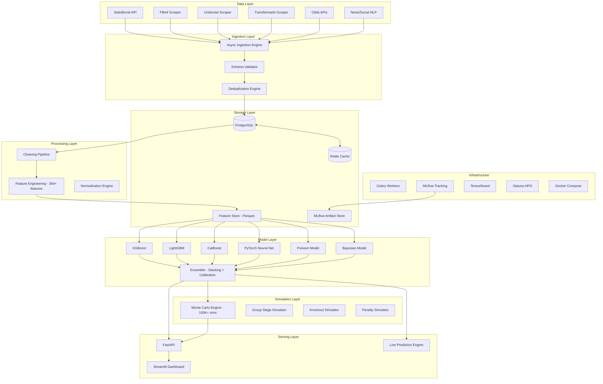
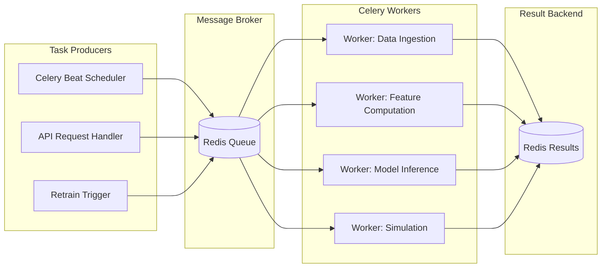
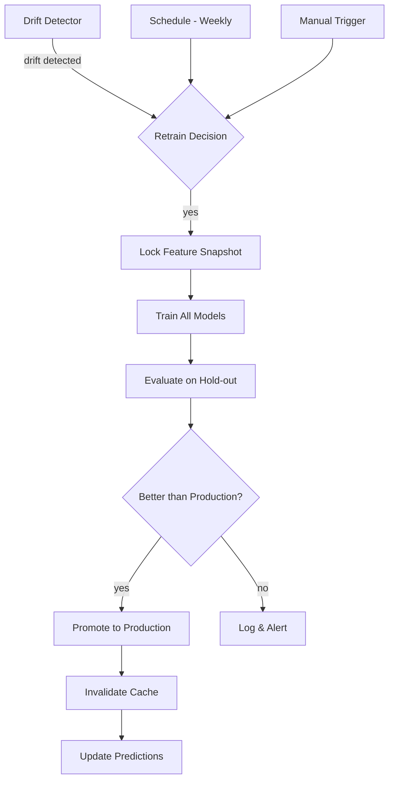
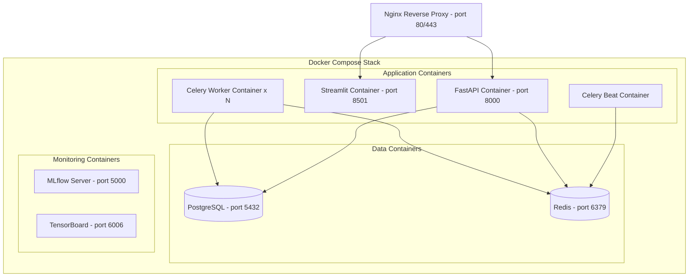

# World Cup AI — System Architecture

## 1. High-Level Architecture



## 2. Subsystem Responsibilities

### 2.1 Data Ingestion Engine
- **Responsibility**: Collect raw data from 6+ external sources
- **Pattern**: Async producer-consumer with rate limiting
- **Concurrency**: `aiohttp` session pool (max 10 concurrent per source)
- **Retry**: Exponential backoff (base=2s, max=300s, jitter=True)
- **Scheduling**: Celery Beat periodic tasks
- **Output**: Raw JSON/CSV → PostgreSQL `raw_*` staging tables

### 2.2 Data Cleaning Pipeline
- **Responsibility**: Validate, deduplicate, normalize, impute
- **Pattern**: DAG of transform stages (each stage = pure function)
- **Idempotency**: Every stage is rerunnable; checkpointed via hash
- **Output**: Cleaned records in PostgreSQL `clean_*` tables

### 2.3 Feature Engineering Engine
- **Responsibility**: Compute 300+ features from cleaned data
- **Pattern**: Registry-based feature functions with dependency resolution
- **Computation**: Polars for vectorized rolling aggregations
- **Leakage Prevention**: Strict temporal filtering — features only use data available BEFORE the match date
- **Output**: Feature matrices as partitioned Parquet in `data/features/`

### 2.4 Model Training System
- **Responsibility**: Train 6 model families, optimize hyperparameters, track experiments
- **Pattern**: Strategy pattern — each model implements `BasePredictor` interface
- **GPU**: PyTorch uses CUDA mixed precision; XGBoost/LightGBM use `gpu_hist`
- **Tracking**: MLflow logs params, metrics, artifacts; Optuna manages HPO trials
- **Validation**: Walk-forward temporal CV (no future leakage)

### 2.5 Ensemble System
- **Responsibility**: Combine model predictions into calibrated probabilities
- **Methods**: (1) Weighted averaging, (2) Logistic stacking meta-learner, (3) Isotonic calibration
- **Calibration**: Platt scaling + isotonic regression on held-out calibration set
- **Output**: Calibrated P(home_win), P(draw), P(away_win) + score distributions

### 2.6 Monte Carlo Simulation Engine
- **Responsibility**: Simulate entire World Cup tournament 100K+ times
- **Pattern**: Vectorized NumPy simulation with multiprocessing pool
- **Models**: Uses ensemble probabilities + Poisson score model
- **Dynamics**: Fatigue accumulation, injury probability, squad rotation
- **Output**: Championship %, semifinal %, Golden Boot %, expected goals

### 2.7 FastAPI Prediction Service
- **Responsibility**: Serve predictions via REST API
- **Endpoints**: `/predict_match`, `/simulate_tournament`, `/golden_boot`, `/team_strength`, `/live_predictions`
- **Caching**: Redis with 5-min TTL for match predictions, 1-hour TTL for simulations
- **Auth**: API key middleware
- **Docs**: Auto-generated OpenAPI/Swagger

### 2.8 Live Prediction Engine
- **Responsibility**: Continuously update predictions with latest data
- **Pattern**: Celery worker polling for lineup/injury/odds changes
- **Frequency**: Every 15 minutes during match week, every 5 minutes on match day
- **Cache Invalidation**: Redis pub/sub on data change events

### 2.9 Streamlit Dashboard
- **Responsibility**: Visual interface for predictions, analytics, simulations
- **Pages**: Match predictions, team rankings, player analytics, tournament sim, odds comparison, SHAP explanations
- **Refresh**: Auto-refresh every 60 seconds for live data

## 3. Data Flow

```mermaid
flowchart LR
    subgraph Ingestion
        A1[Raw Sources] -->|async fetch| A2[Schema Validation]
        A2 -->|validated| A3[Dedup + Upsert]
        A3 -->|raw tables| A4[(PostgreSQL raw_*)]
    end

    subgraph Processing
        A4 -->|batch read| B1[Cleaning DAG]
        B1 -->|clean tables| B2[(PostgreSQL clean_*)]
        B2 -->|temporal join| B3[Feature Engine]
        B3 -->|feature matrix| B4[Parquet Store]
    end

    subgraph Training
        B4 -->|walk-forward split| C1[Train Set]
        B4 -->|walk-forward split| C2[Val Set]
        B4 -->|walk-forward split| C3[Cal Set]
        C1 --> C4[Model Training]
        C2 --> C5[Early Stopping]
        C3 --> C6[Calibration]
        C4 --> C7[MLflow Registry]
    end

    subgraph Inference
        C7 -->|load best| D1[Ensemble]
        D1 --> D2[Match Probabilities]
        D1 --> D3[Score Distributions]
        D2 & D3 --> D4[Monte Carlo Sim]
        D4 --> D5[Tournament Outcomes]
    end
```



## 4. Training Flow

1. `train.py` is invoked (single entry point)
2. **Data Check**: Verify PostgreSQL connectivity, check data freshness
3. **Feature Build**: Run feature engineering pipeline (incremental if possible)
4. **Split**: Walk-forward temporal split:
   - Train: all matches before T-12 months
   - Validation: T-12 to T-6 months
   - Calibration: T-6 to T-3 months
   - Test: T-3 months to present
5. **Model Training** (parallel where possible):
   - XGBoost → Optuna HPO (100 trials) → best checkpoint
   - LightGBM → Optuna HPO (100 trials) → best checkpoint
   - CatBoost → Optuna HPO (100 trials) → best checkpoint
   - PyTorch NN → mixed precision training → early stopping
   - Poisson → MLE fitting
   - Bayesian → MCMC sampling
6. **Ensemble**: Train stacking meta-learner on validation predictions
7. **Calibration**: Fit isotonic regression on calibration set
8. **Evaluation**: Compute metrics on test set (log loss, Brier, calibration)
9. **Registry**: Log everything to MLflow; promote best model to "Production"
10. **Export**: Save predictions, generate evaluation report

## 5. Inference Flow

1. Request arrives at `/predict_match` with `home_team`, `away_team`, `date`
2. Check Redis cache → if fresh, return cached result
3. Load latest features for both teams from feature store
4. Run through ensemble pipeline:
   - Each model produces raw probabilities
   - Stacking meta-learner combines
   - Isotonic calibration adjusts
5. Poisson model generates score distribution (0-0 through 10-10)
6. Return: `{home_win: 0.45, draw: 0.25, away_win: 0.30, scores: {...}}`
7. Cache result in Redis (TTL = 5 min)

## 6. GPU Training Architecture

```
┌─────────────────────────────────────────────┐
│              GPU Training Host              │
│                                             │
│  ┌─────────────┐  ┌──────────────────────┐  │
│  │ XGBoost     │  │ PyTorch NN           │  │
│  │ gpu_hist    │  │ CUDA + AMP           │  │
│  │ tree_method │  │ torch.cuda.amp       │  │
│  └─────────────┘  │ GradScaler           │  │
│                    │ DataLoader(pin_mem)  │  │
│  ┌─────────────┐  │ DistributedDataPar.  │  │
│  │ LightGBM    │  └──────────────────────┘  │
│  │ gpu_use_dp  │                            │
│  └─────────────┘  ┌──────────────────────┐  │
│                    │ CatBoost             │  │
│  ┌─────────────┐  │ task_type='GPU'      │  │
│  │ Optuna      │  └──────────────────────┘  │
│  │ Distributed │                            │
│  │ TPE Sampler │  ┌──────────────────────┐  │
│  └─────────────┘  │ MLflow Tracking      │  │
│                    │ TensorBoard Logging  │  │
│                    └──────────────────────┘  │
└─────────────────────────────────────────────┘
```

- **PyTorch**: `torch.cuda.amp.autocast` for FP16 forward pass, FP32 gradients
- **XGBoost**: `tree_method='gpu_hist'`, `predictor='gpu_predictor'`
- **LightGBM**: `device='gpu'`, `gpu_use_dp=True`
- **CatBoost**: `task_type='GPU'`, `devices='0'`
- **Memory**: Gradient checkpointing for large NN; batch size auto-tuning
- **Multi-GPU**: PyTorch `DistributedDataParallel` for NN; single-GPU for tree models

## 7. Async Task Architecture



**Task Queues**:
- `ingestion` — data collection tasks (low priority, rate-limited)
- `features` — feature computation (medium priority)
- `inference` — prediction requests (high priority, fast)
- `simulation` — Monte Carlo runs (low priority, CPU-intensive)

**Celery Beat Schedule**:
| Task | Frequency | Queue |
|------|-----------|-------|
| Ingest StatsBomb | Daily 02:00 UTC | ingestion |
| Ingest FBref | Daily 03:00 UTC | ingestion |
| Ingest odds | Every 15 min | ingestion |
| Ingest injuries | Every 30 min | ingestion |
| Rebuild features | Daily 06:00 UTC | features |
| Refresh predictions | Every 15 min (match week) | inference |
| Full simulation | Daily 07:00 UTC | simulation |

## 8. Retraining Architecture



**Drift Detection**:
- Monitor feature distributions (KL divergence) weekly
- Monitor prediction calibration (reliability diagram) weekly
- Trigger retrain if KL > 0.1 or calibration error > 0.05

**Champion-Challenger**:
- New model must beat production on Brier score by ≥ 0.005
- Automatic rollback if live Brier degrades by > 0.01 within 48h

## 9. Deployment Architecture



**GPU Container**: Training container with NVIDIA runtime, mounted volumes for data/models.

## 10. Scaling Strategy

| Component | Scaling Method | Trigger |
|-----------|---------------|---------|
| FastAPI | Horizontal (replicas) | CPU > 70% |
| Celery Workers | Horizontal (add workers) | Queue depth > 100 |
| PostgreSQL | Vertical + read replicas | Connection count > 80% |
| Redis | Vertical (memory) | Memory > 80% |
| Monte Carlo | Multiprocessing pool | Fixed at CPU count |
| Model Training | Vertical (bigger GPU) | Training time > 4h |

**Resource Estimates**:
- Training: 1x NVIDIA A100 (40GB), ~2h for full pipeline
- Inference: 2 CPU cores, 4GB RAM per API replica
- Simulation: 8 CPU cores, 16GB RAM for 100K sims
- Database: 4 CPU cores, 16GB RAM, 100GB SSD
