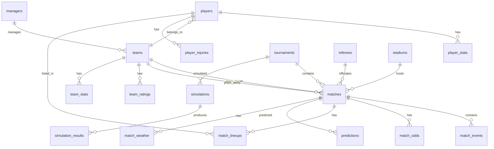

# World Cup AI — Database Design

## 1. Entity-Relationship Diagram



## 2. Complete Schema

### 2.1 Core Tables

#### `teams`
| Column | Type | Constraints | Description |
|--------|------|-------------|-------------|
| team_id | SERIAL | PK | Auto-increment ID |
| team_name | VARCHAR(100) | NOT NULL, UNIQUE | Official team name |
| team_code | VARCHAR(3) | NOT NULL, UNIQUE | FIFA country code (e.g. BRA) |
| confederation | VARCHAR(20) | NOT NULL | AFC, CAF, CONCACAF, CONMEBOL, OFC, UEFA |
| fifa_ranking | INTEGER | | Current FIFA ranking |
| elo_rating | FLOAT | DEFAULT 1500 | Current Elo rating |
| squad_value_eur | BIGINT | | Total squad market value |
| created_at | TIMESTAMPTZ | DEFAULT NOW() | |
| updated_at | TIMESTAMPTZ | DEFAULT NOW() | |

**Indexes**: `idx_teams_code` on `team_code`, `idx_teams_confederation` on `confederation`

#### `players`
| Column | Type | Constraints | Description |
|--------|------|-------------|-------------|
| player_id | SERIAL | PK | |
| player_name | VARCHAR(150) | NOT NULL | |
| date_of_birth | DATE | | |
| nationality | VARCHAR(100) | | |
| current_team_id | INTEGER | FK → teams.team_id | |
| club_name | VARCHAR(100) | | Club team name |
| position | VARCHAR(20) | | GK/DEF/MID/FWD |
| preferred_foot | VARCHAR(5) | | L/R/Both |
| height_cm | SMALLINT | | |
| weight_kg | SMALLINT | | |
| market_value_eur | BIGINT | | Transfermarkt value |
| statsbomb_id | INTEGER | UNIQUE | StatsBomb player ID |
| fbref_id | VARCHAR(50) | UNIQUE | FBref player ID |
| created_at | TIMESTAMPTZ | DEFAULT NOW() | |
| updated_at | TIMESTAMPTZ | DEFAULT NOW() | |

**Indexes**: `idx_players_team` on `current_team_id`, `idx_players_position` on `position`, `idx_players_statsbomb` on `statsbomb_id`

#### `tournaments`
| Column | Type | Constraints | Description |
|--------|------|-------------|-------------|
| tournament_id | SERIAL | PK | |
| tournament_name | VARCHAR(100) | NOT NULL | e.g. FIFA World Cup 2026 |
| tournament_type | VARCHAR(30) | NOT NULL | world_cup / continental / friendly / qualifier |
| year | SMALLINT | NOT NULL | |
| host_country | VARCHAR(100) | | |
| start_date | DATE | | |
| end_date | DATE | | |
| format | JSONB | | Group sizes, knockout structure |

#### `stadiums`
| Column | Type | Constraints | Description |
|--------|------|-------------|-------------|
| stadium_id | SERIAL | PK | |
| stadium_name | VARCHAR(150) | NOT NULL | |
| city | VARCHAR(100) | | |
| country | VARCHAR(100) | | |
| latitude | FLOAT | | |
| longitude | FLOAT | | |
| altitude_m | INTEGER | DEFAULT 0 | Meters above sea level |
| capacity | INTEGER | | |

#### `referees`
| Column | Type | Constraints | Description |
|--------|------|-------------|-------------|
| referee_id | SERIAL | PK | |
| referee_name | VARCHAR(150) | NOT NULL | |
| nationality | VARCHAR(100) | | |
| avg_fouls_per_match | FLOAT | | |
| avg_cards_per_match | FLOAT | | |
| avg_penalties_per_match | FLOAT | | |

#### `managers`
| Column | Type | Constraints | Description |
|--------|------|-------------|-------------|
| manager_id | SERIAL | PK | |
| manager_name | VARCHAR(150) | NOT NULL | |
| nationality | VARCHAR(100) | | |
| team_id | INTEGER | FK → teams.team_id | |
| appointed_date | DATE | | |
| win_rate | FLOAT | | |
| tactical_style | VARCHAR(50) | | possession / counter / press / balanced |

### 2.2 Match Tables

#### `matches`
| Column | Type | Constraints | Description |
|--------|------|-------------|-------------|
| match_id | SERIAL | PK | |
| statsbomb_match_id | INTEGER | UNIQUE | |
| tournament_id | INTEGER | FK → tournaments | |
| match_date | DATE | NOT NULL | |
| kickoff_time | TIMESTAMPTZ | | |
| home_team_id | INTEGER | FK → teams, NOT NULL | |
| away_team_id | INTEGER | FK → teams, NOT NULL | |
| stadium_id | INTEGER | FK → stadiums | |
| referee_id | INTEGER | FK → referees | |
| home_score | SMALLINT | | |
| away_score | SMALLINT | | |
| home_score_ht | SMALLINT | | Half-time |
| away_score_ht | SMALLINT | | Half-time |
| result | VARCHAR(4) | CHECK IN ('H','D','A') | Home/Draw/Away |
| stage | VARCHAR(30) | | group / R16 / QF / SF / F |
| group_name | VARCHAR(5) | | A, B, C, ... |
| attendance | INTEGER | | |
| extra_time | BOOLEAN | DEFAULT FALSE | |
| penalties | BOOLEAN | DEFAULT FALSE | |
| home_penalty_score | SMALLINT | | |
| away_penalty_score | SMALLINT | | |
| data_source | VARCHAR(30) | | statsbomb / fbref / manual |
| created_at | TIMESTAMPTZ | DEFAULT NOW() | |

**Indexes**: 
- `idx_matches_date` on `match_date`
- `idx_matches_home` on `home_team_id`
- `idx_matches_away` on `away_team_id`
- `idx_matches_tournament` on `tournament_id`
- `idx_matches_date_teams` on `(match_date, home_team_id, away_team_id)` — composite for dedup

**Partitioning**: Range partition on `match_date` by year

#### `match_events`
| Column | Type | Constraints | Description |
|--------|------|-------------|-------------|
| event_id | BIGSERIAL | PK | |
| match_id | INTEGER | FK → matches, NOT NULL | |
| player_id | INTEGER | FK → players | |
| team_id | INTEGER | FK → teams | |
| event_type | VARCHAR(30) | NOT NULL | goal / shot / pass / tackle / card / sub |
| minute | SMALLINT | | |
| second | SMALLINT | | |
| period | SMALLINT | | 1=first half, 2=second, 3=ET1, 4=ET2 |
| x_coord | FLOAT | | Pitch x (0-120) |
| y_coord | FLOAT | | Pitch y (0-80) |
| end_x | FLOAT | | |
| end_y | FLOAT | | |
| xg | FLOAT | | Expected goals for shots |
| outcome | VARCHAR(30) | | on_target / off_target / blocked / goal |
| body_part | VARCHAR(20) | | foot / head / other |
| technique | VARCHAR(30) | | |
| pass_type | VARCHAR(30) | | ground / lofted / through / cross |
| event_data | JSONB | | Additional event-specific data |

**Indexes**: `idx_events_match` on `match_id`, `idx_events_type` on `event_type`, `idx_events_player` on `player_id`
**Partitioning**: Range partition on `match_id` ranges (every 10K matches)

#### `match_lineups`
| Column | Type | Constraints | Description |
|--------|------|-------------|-------------|
| lineup_id | BIGSERIAL | PK | |
| match_id | INTEGER | FK → matches | |
| team_id | INTEGER | FK → teams | |
| player_id | INTEGER | FK → players | |
| position | VARCHAR(20) | | |
| is_starter | BOOLEAN | DEFAULT TRUE | |
| minutes_played | SMALLINT | | |
| jersey_number | SMALLINT | | |
| replaced_by | INTEGER | FK → players | Sub replacement |
| sub_minute | SMALLINT | | Minute subbed on/off |

**Index**: `idx_lineups_match_team` on `(match_id, team_id)`

#### `match_weather`
| Column | Type | Constraints | Description |
|--------|------|-------------|-------------|
| weather_id | SERIAL | PK | |
| match_id | INTEGER | FK → matches, UNIQUE | |
| temperature_c | FLOAT | | |
| humidity_pct | FLOAT | | |
| wind_speed_kmh | FLOAT | | |
| wind_direction | VARCHAR(5) | | |
| precipitation_mm | FLOAT | | |
| condition | VARCHAR(30) | | clear / cloudy / rain / snow |

### 2.3 Stats Tables

#### `team_stats`
| Column | Type | Constraints | Description |
|--------|------|-------------|-------------|
| stat_id | BIGSERIAL | PK | |
| team_id | INTEGER | FK → teams, NOT NULL | |
| match_id | INTEGER | FK → matches | |
| stat_date | DATE | NOT NULL | |
| possession_pct | FLOAT | | |
| shots | SMALLINT | | |
| shots_on_target | SMALLINT | | |
| xg | FLOAT | | Expected goals |
| xga | FLOAT | | Expected goals against |
| passes_completed | SMALLINT | | |
| pass_accuracy_pct | FLOAT | | |
| ppda | FLOAT | | Passes per defensive action |
| pressing_intensity | FLOAT | | |
| tackles | SMALLINT | | |
| interceptions | SMALLINT | | |
| clearances | SMALLINT | | |
| corners | SMALLINT | | |
| fouls_committed | SMALLINT | | |
| fouls_won | SMALLINT | | |
| offsides | SMALLINT | | |
| progressive_passes | SMALLINT | | |
| progressive_carries | SMALLINT | | |
| sca | SMALLINT | | Shot creating actions |
| gca | SMALLINT | | Goal creating actions |
| defensive_line_height | FLOAT | | Average Y of defensive line |
| counter_attacks | SMALLINT | | |

**Index**: `idx_team_stats_team_date` on `(team_id, stat_date)`

#### `player_stats`
| Column | Type | Constraints | Description |
|--------|------|-------------|-------------|
| stat_id | BIGSERIAL | PK | |
| player_id | INTEGER | FK → players, NOT NULL | |
| match_id | INTEGER | FK → matches | |
| stat_date | DATE | NOT NULL | |
| minutes_played | SMALLINT | | |
| goals | SMALLINT | | |
| assists | SMALLINT | | |
| xg | FLOAT | | |
| xa | FLOAT | | Expected assists |
| shots | SMALLINT | | |
| shots_on_target | SMALLINT | | |
| key_passes | SMALLINT | | |
| progressive_passes | SMALLINT | | |
| progressive_carries | SMALLINT | | |
| touches_in_box | SMALLINT | | |
| dribbles_completed | SMALLINT | | |
| tackles_won | SMALLINT | | |
| interceptions | SMALLINT | | |
| blocks | SMALLINT | | |
| aerials_won | SMALLINT | | |
| sprint_distance_km | FLOAT | | |
| total_distance_km | FLOAT | | |
| pass_completion_pct | FLOAT | | |
| sca | SMALLINT | | |
| gca | SMALLINT | | |

**Index**: `idx_player_stats_player_date` on `(player_id, stat_date)`

#### `team_ratings`
| Column | Type | Constraints | Description |
|--------|------|-------------|-------------|
| rating_id | SERIAL | PK | |
| team_id | INTEGER | FK → teams, NOT NULL | |
| rating_date | DATE | NOT NULL | |
| elo_rating | FLOAT | NOT NULL | |
| elo_delta | FLOAT | | Change from previous |
| fifa_ranking | INTEGER | | |
| glicko_rating | FLOAT | | |
| glicko_rd | FLOAT | | Glicko rating deviation |
| attack_strength | FLOAT | | |
| defense_strength | FLOAT | | |
| form_score | FLOAT | | Last 10 matches weighted |

**Index**: `idx_ratings_team_date` on `(team_id, rating_date)` UNIQUE

### 2.4 Odds & Market Tables

#### `match_odds`
| Column | Type | Constraints | Description |
|--------|------|-------------|-------------|
| odds_id | BIGSERIAL | PK | |
| match_id | INTEGER | FK → matches, NOT NULL | |
| bookmaker | VARCHAR(30) | NOT NULL | pinnacle / bet365 / betfair |
| odds_type | VARCHAR(20) | NOT NULL | opening / closing / live |
| timestamp | TIMESTAMPTZ | NOT NULL | |
| home_odds | FLOAT | | Decimal odds |
| draw_odds | FLOAT | | |
| away_odds | FLOAT | | |
| home_implied_prob | FLOAT | | After removing overround |
| draw_implied_prob | FLOAT | | |
| away_implied_prob | FLOAT | | |
| overround | FLOAT | | Total implied probability |
| over_2_5 | FLOAT | | Over 2.5 goals odds |
| under_2_5 | FLOAT | | |
| btts_yes | FLOAT | | Both teams to score |
| btts_no | FLOAT | | |

**Index**: `idx_odds_match_book` on `(match_id, bookmaker, odds_type)`

### 2.5 Injury & Availability Tables

#### `player_injuries`
| Column | Type | Constraints | Description |
|--------|------|-------------|-------------|
| injury_id | SERIAL | PK | |
| player_id | INTEGER | FK → players, NOT NULL | |
| injury_type | VARCHAR(50) | | hamstring / ACL / muscle / etc |
| injury_date | DATE | | |
| expected_return | DATE | | |
| severity | VARCHAR(10) | | minor / moderate / severe |
| is_active | BOOLEAN | DEFAULT TRUE | |
| source | VARCHAR(30) | | transfermarkt / news |
| updated_at | TIMESTAMPTZ | DEFAULT NOW() | |

**Index**: `idx_injuries_player_active` on `(player_id, is_active)`

### 2.6 Prediction & Simulation Tables

#### `predictions`
| Column | Type | Constraints | Description |
|--------|------|-------------|-------------|
| prediction_id | BIGSERIAL | PK | |
| match_id | INTEGER | FK → matches, NOT NULL | |
| model_version | VARCHAR(50) | NOT NULL | |
| predicted_at | TIMESTAMPTZ | DEFAULT NOW() | |
| home_win_prob | FLOAT | NOT NULL | |
| draw_prob | FLOAT | NOT NULL | |
| away_win_prob | FLOAT | NOT NULL | |
| predicted_home_goals | FLOAT | | Expected goals home |
| predicted_away_goals | FLOAT | | Expected goals away |
| score_distribution | JSONB | | {\"1-0\": 0.12, ...} |
| confidence | FLOAT | | Model confidence |
| model_contributions | JSONB | | Per-model probabilities |
| features_used | JSONB | | Feature snapshot |
| is_live | BOOLEAN | DEFAULT FALSE | |

**Index**: `idx_predictions_match_model` on `(match_id, model_version)`

#### `simulations`
| Column | Type | Constraints | Description |
|--------|------|-------------|-------------|
| simulation_id | SERIAL | PK | |
| tournament_id | INTEGER | FK → tournaments | |
| run_date | TIMESTAMPTZ | DEFAULT NOW() | |
| num_simulations | INTEGER | NOT NULL | |
| model_version | VARCHAR(50) | | |
| config | JSONB | | Simulation parameters |

#### `simulation_results`
| Column | Type | Constraints | Description |
|--------|------|-------------|-------------|
| result_id | BIGSERIAL | PK | |
| simulation_id | INTEGER | FK → simulations | |
| team_id | INTEGER | FK → teams | |
| champion_prob | FLOAT | | |
| final_prob | FLOAT | | |
| semifinal_prob | FLOAT | | |
| quarterfinal_prob | FLOAT | | |
| group_exit_prob | FLOAT | | |
| avg_goals_scored | FLOAT | | |
| avg_goals_conceded | FLOAT | | |
| golden_boot_prob | FLOAT | | |
| expected_points_group | FLOAT | | |

**Index**: `idx_simresults_sim_team` on `(simulation_id, team_id)`

### 2.7 NLP & Sentiment Tables

#### `news_sentiment`
| Column | Type | Constraints | Description |
|--------|------|-------------|-------------|
| sentiment_id | BIGSERIAL | PK | |
| team_id | INTEGER | FK → teams | |
| player_id | INTEGER | FK → players | |
| source | VARCHAR(20) | | twitter / reddit / news |
| text_snippet | TEXT | | |
| sentiment_score | FLOAT | | -1.0 to 1.0 |
| topic | VARCHAR(30) | | injury / morale / form / controversy |
| published_at | TIMESTAMPTZ | | |
| processed_at | TIMESTAMPTZ | DEFAULT NOW() | |

**Index**: `idx_sentiment_team_date` on `(team_id, published_at)`

## 3. Optimization Strategy

### Partitioning
- `matches`: RANGE on `match_date` by year
- `match_events`: RANGE on `match_id` (10K per partition)
- `player_stats`: RANGE on `stat_date` by year
- `news_sentiment`: RANGE on `published_at` by month

### Materialized Views
```sql
-- Team form: last N matches rolling stats
CREATE MATERIALIZED VIEW mv_team_form AS
SELECT team_id, match_date,
    AVG(xg) OVER w AS rolling_xg_5,
    AVG(xga) OVER w AS rolling_xga_5,
    AVG(possession_pct) OVER w AS rolling_poss_5
FROM team_stats
WINDOW w AS (PARTITION BY team_id ORDER BY match_date ROWS 5 PRECEDING);

-- Player cumulative season stats
CREATE MATERIALIZED VIEW mv_player_season AS
SELECT player_id, 
    EXTRACT(YEAR FROM stat_date) AS season,
    SUM(goals) AS total_goals,
    SUM(assists) AS total_assists,
    AVG(xg) AS avg_xg,
    SUM(minutes_played) AS total_minutes
FROM player_stats
GROUP BY player_id, EXTRACT(YEAR FROM stat_date);
```

### Key Query Patterns & Indexes
```sql
-- Most common query: get team's recent matches with stats
CREATE INDEX idx_matches_team_date_composite 
ON matches (home_team_id, match_date DESC);

CREATE INDEX idx_matches_away_team_date 
ON matches (away_team_id, match_date DESC);

-- Feature engineering: rolling stats lookup
CREATE INDEX idx_team_stats_team_date_covering 
ON team_stats (team_id, stat_date DESC) 
INCLUDE (xg, xga, possession_pct, ppda);

-- Odds comparison query
CREATE INDEX idx_odds_match_timestamp 
ON match_odds (match_id, timestamp DESC);

-- Active injuries lookup
CREATE INDEX idx_injuries_active 
ON player_injuries (is_active) WHERE is_active = TRUE;
```

### Connection Pooling
- Use `asyncpg` with SQLAlchemy async engine
- Pool size: 20 connections (API), 5 connections (workers)
- Overflow: 10 additional connections
- Pool recycle: 3600 seconds

## 4. Migration Strategy

Migrations managed via **Alembic**:
- `alembic/versions/001_initial_schema.py` — Create all tables
- `alembic/versions/002_add_partitions.py` — Add range partitions
- `alembic/versions/003_add_materialized_views.py` — Create MVs
- `alembic/versions/004_add_indexes.py` — Create performance indexes

Each migration is idempotent and rollback-safe.
