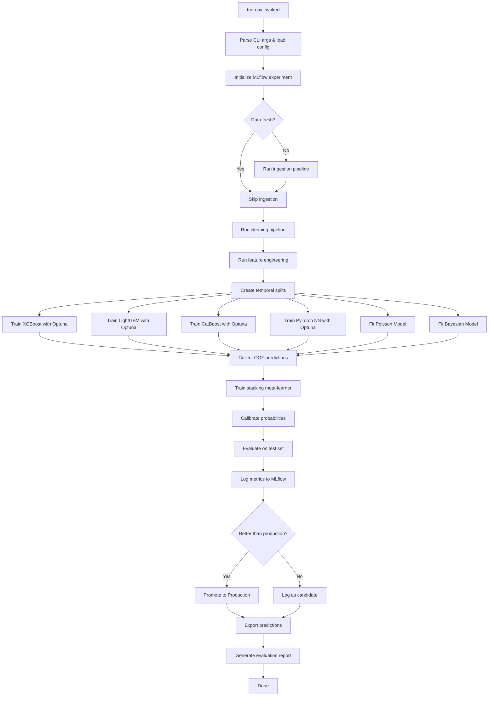
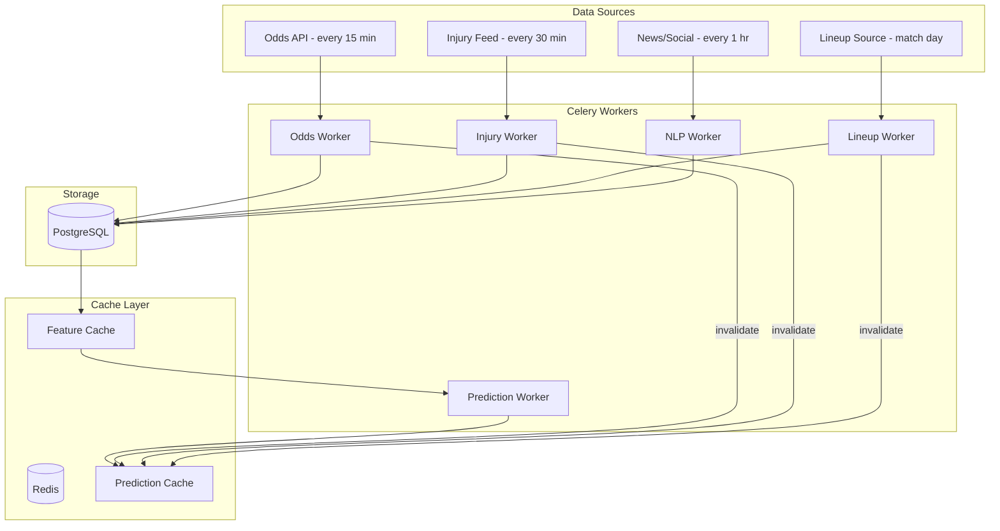

# World Cup AI — Training Pipeline, Live System, Evaluation & Research

## Part 1: Training Pipeline Design

### 1.1 `train.py` Execution Flow



### 1.2 CLI Interface
```bash
python train.py \
    --config configs/train_config.yaml \
    --experiment-name "wc2026_v3" \
    --gpu-id 0 \
    --n-optuna-trials 100 \
    --skip-ingestion \
    --skip-cleaning \
    --models xgboost,lightgbm,catboost,neural_net,poisson,bayesian \
    --ensemble-method stacking \
    --n-cv-folds 5 \
    --seed 42
```

### 1.3 Temporal Split Strategy
```
All matches sorted by date:
|--- Train ---|--- Val ---|--- Cal ---|--- Test ---|
   < T-24mo    T-24 to     T-12 to     T-6 to
                T-12mo      T-6mo       present

Walk-forward CV within training set:
Fold 1: train on [start, T1], validate on [T1, T2]
Fold 2: train on [start, T2], validate on [T2, T3]
Fold 3: train on [start, T3], validate on [T3, T4]
Fold 4: train on [start, T4], validate on [T4, T5]
Fold 5: train on [start, T5], validate on [T5, T_end_train]
```

### 1.4 Distributed Training (PyTorch)
```python
# Multi-GPU setup (if available)
if torch.cuda.device_count() > 1:
    model = torch.nn.parallel.DistributedDataParallel(
        model, device_ids=[local_rank]
    )
    
# Mixed precision training
scaler = torch.cuda.amp.GradScaler()

for batch in dataloader:
    optimizer.zero_grad()
    
    with torch.cuda.amp.autocast():
        outputs = model(batch.features)
        loss = criterion(outputs, batch.targets)
    
    scaler.scale(loss).backward()
    scaler.unscale_(optimizer)
    torch.nn.utils.clip_grad_norm_(model.parameters(), max_norm=1.0)
    scaler.step(optimizer)
    scaler.update()
```

### 1.5 Checkpointing
```python
# Save checkpoint after each epoch
checkpoint = {
    "epoch": epoch,
    "model_state_dict": model.state_dict(),
    "optimizer_state_dict": optimizer.state_dict(),
    "scheduler_state_dict": scheduler.state_dict(),
    "scaler_state_dict": scaler.state_dict(),
    "best_val_loss": best_val_loss,
    "config": config,
}
torch.save(checkpoint, f"data/models/nn_checkpoint_epoch{epoch}.pt")

# Resume from checkpoint
if args.resume:
    checkpoint = torch.load(args.resume)
    model.load_state_dict(checkpoint["model_state_dict"])
    optimizer.load_state_dict(checkpoint["optimizer_state_dict"])
    start_epoch = checkpoint["epoch"] + 1
```

### 1.6 Optuna Integration
```python
def objective(trial: optuna.Trial) -> float:
    params = {
        "n_estimators": trial.suggest_int("n_estimators", 200, 3000),
        "max_depth": trial.suggest_int("max_depth", 3, 12),
        "learning_rate": trial.suggest_float("learning_rate", 0.005, 0.3, log=True),
        # ... more params
    }
    
    scores = []
    for fold in walk_forward_folds:
        model = XGBClassifier(**params)
        model.fit(fold.X_train, fold.y_train,
                  eval_set=[(fold.X_val, fold.y_val)],
                  early_stopping_rounds=50, verbose=False)
        pred = model.predict_proba(fold.X_val)
        scores.append(log_loss(fold.y_val, pred))
    
    return np.mean(scores)

study = optuna.create_study(
    direction="minimize",
    sampler=optuna.samplers.TPESampler(seed=42),
    pruner=optuna.pruners.MedianPruner(n_warmup_steps=10),
    storage="sqlite:///data/optuna.db",
    study_name="xgboost_v3",
    load_if_exists=True,
)
study.optimize(objective, n_trials=100, n_jobs=1, gc_after_trial=True)
```

### 1.7 MLflow Tracking
```python
with mlflow.start_run(run_name=f"ensemble_{timestamp}"):
    # Log parameters
    mlflow.log_params({"n_models": 6, "ensemble_method": "stacking", ...})
    
    # Log each model's metrics
    for model_name, metrics in model_metrics.items():
        mlflow.log_metric(f"{model_name}_log_loss", metrics["log_loss"])
        mlflow.log_metric(f"{model_name}_brier", metrics["brier_score"])
    
    # Log ensemble metrics
    mlflow.log_metric("ensemble_log_loss", ensemble_log_loss)
    mlflow.log_metric("ensemble_brier", ensemble_brier)
    mlflow.log_metric("ensemble_ece", ensemble_ece)
    
    # Log artifacts
    mlflow.log_artifact("data/models/ensemble_weights.json")
    mlflow.log_artifact("reports/calibration_plot.png")
    mlflow.log_artifact("reports/feature_importance.png")
    
    # Register model
    mlflow.sklearn.log_model(ensemble_model, "ensemble_model",
                             registered_model_name="world_cup_ensemble")
```

---

## Part 2: Live Prediction System Design

### 2.1 Architecture



### 2.2 Redis Cache Architecture
```python
# Cache key patterns
CACHE_KEYS = {
    "match_prediction": "pred:match:{match_id}:{model_version}",
    "team_features": "feat:team:{team_id}:{date}",
    "tournament_sim": "sim:tournament:{tournament_id}:{date}",
    "odds_latest": "odds:match:{match_id}:latest",
    "lineup_latest": "lineup:match:{match_id}:latest",
}

# TTL strategy
TTL = {
    "match_prediction": 300,     # 5 minutes
    "team_features": 3600,       # 1 hour
    "tournament_sim": 3600,      # 1 hour
    "odds_latest": 900,          # 15 minutes
    "lineup_latest": 1800,       # 30 minutes
}
```

### 2.3 Celery Task Definitions
```python
@celery_app.task(queue="ingestion", rate_limit="4/m")
def fetch_latest_odds(match_id: int):
    """Fetch and store latest odds for a match."""
    odds_data = odds_api.get_match_odds(match_id)
    store_odds(odds_data)
    # Invalidate prediction cache
    redis.delete(f"pred:match:{match_id}:*")
    # Trigger re-prediction
    refresh_match_prediction.delay(match_id)

@celery_app.task(queue="inference", priority=9)
def refresh_match_prediction(match_id: int):
    """Recompute prediction for a match with latest data."""
    features = build_match_features(match_id)
    prediction = ensemble.predict(features)
    cache_prediction(match_id, prediction)
    return prediction

@celery_app.task(queue="ingestion", rate_limit="2/m")
def fetch_injury_updates():
    """Scrape latest injury updates from Transfermarkt."""
    injuries = transfermarkt_scraper.get_latest_injuries()
    store_injuries(injuries)
    # Invalidate affected teams' features
    for team_id in affected_teams(injuries):
        redis.delete(f"feat:team:{team_id}:*")
```

### 2.4 Match-Day Timeline
```
T-7 days:  Initial predictions published (features from latest data)
T-3 days:  Odds monitoring begins (every 15 min)
T-1 day:   Injury updates intensified (every 15 min)
T-6 hours: Lineup rumors incorporated
T-2 hours: Official lineups → immediate prediction refresh
T-1 hour:  Final prediction locked
T-0:       Match starts → live mode (if supported)
T+2 hours: Match ends → record results → update Elo/features
```

---

## Part 3: Evaluation Framework Design

### 3.1 Metrics Suite

| Metric | Formula | Target | Purpose |
|--------|---------|--------|---------|
| Log Loss | -Σ y×log(p) / N | < 1.00 | Primary: probability accuracy |
| Brier Score | Σ (p - y)² / N | < 0.20 | Probability calibration |
| ECE | Σ \|acc_b - conf_b\| × n_b/N | < 0.03 | Calibration error |
| ROI | (profit / total_staked) | > 0% | Betting profitability |
| Accuracy | correct / total | > 50% | Classification accuracy |
| Ranked Prob Score | Σ (CDF_pred - CDF_actual)² | < 0.18 | Ordinal prediction quality |

### 3.2 Walk-Forward Validation
```python
def walk_forward_evaluate(model, data, n_folds=5):
    """
    Time-series cross-validation that never looks ahead.
    
    Fold 1: Train [2010-2015], Test [2015-2016]
    Fold 2: Train [2010-2016], Test [2016-2017]
    Fold 3: Train [2010-2017], Test [2017-2018]
    Fold 4: Train [2010-2018], Test [2018-2020]
    Fold 5: Train [2010-2020], Test [2020-2022]
    """
    results = []
    for fold in generate_temporal_folds(data, n_folds):
        model.fit(fold.X_train, fold.y_train)
        pred = model.predict_proba(fold.X_test)
        
        results.append({
            "fold": fold.id,
            "period": f"{fold.test_start} to {fold.test_end}",
            "log_loss": log_loss(fold.y_test, pred),
            "brier": brier_score(fold.y_test, pred),
            "n_samples": len(fold.y_test),
        })
    
    return results
```

### 3.3 Calibration Analysis
```python
def calibration_analysis(y_true, y_prob, n_bins=10):
    """
    Generate reliability diagram data.
    
    For each probability bin:
    - Mean predicted probability
    - Observed frequency (actual outcome rate)
    - Count of samples in bin
    """
    bin_edges = np.linspace(0, 1, n_bins + 1)
    calibration_data = []
    
    for i in range(n_bins):
        mask = (y_prob >= bin_edges[i]) & (y_prob < bin_edges[i+1])
        if mask.sum() > 0:
            calibration_data.append({
                "bin_center": (bin_edges[i] + bin_edges[i+1]) / 2,
                "mean_predicted": y_prob[mask].mean(),
                "observed_frequency": y_true[mask].mean(),
                "count": mask.sum(),
            })
    
    # Expected Calibration Error
    ece = sum(
        d["count"] * abs(d["mean_predicted"] - d["observed_frequency"])
        for d in calibration_data
    ) / len(y_true)
    
    return calibration_data, ece
```

### 3.4 SHAP Analysis
```python
def generate_shap_analysis(model, X_test, feature_names):
    """Generate SHAP explanations for model predictions."""
    explainer = shap.TreeExplainer(model)  # For tree models
    shap_values = explainer.shap_values(X_test)
    
    # Summary plot: feature importance ranking
    shap.summary_plot(shap_values, X_test, feature_names=feature_names,
                      show=False)
    plt.savefig("reports/shap_summary.png", dpi=150, bbox_inches="tight")
    
    # Dependence plots for top features
    top_features = get_top_features(shap_values, n=10)
    for feat in top_features:
        shap.dependence_plot(feat, shap_values, X_test,
                            feature_names=feature_names, show=False)
        plt.savefig(f"reports/shap_dep_{feat}.png", dpi=150)
    
    return shap_values
```

### 3.5 ROI Evaluation (Betting Simulation)
```python
def evaluate_roi(predictions, actual_results, odds_data, strategy="kelly"):
    """
    Simulate betting performance using model predictions vs market odds.
    
    Kelly Criterion: f* = (p × b - q) / b
    where p = model probability, q = 1-p, b = decimal odds - 1
    
    Only bet when expected value > threshold (e.g., EV > 2%)
    """
    total_staked = 0
    total_return = 0
    bets = []
    
    for match in predictions:
        for outcome in ["home", "draw", "away"]:
            model_prob = match.probabilities[outcome]
            market_odds = odds_data[match.id][outcome]
            ev = model_prob * market_odds - 1
            
            if ev > 0.02:  # Only bet if EV > 2%
                if strategy == "kelly":
                    fraction = (model_prob * market_odds - 1) / (market_odds - 1)
                    fraction = min(fraction, 0.05)  # Cap at 5% of bankroll
                elif strategy == "flat":
                    fraction = 0.01  # 1% flat stake
                
                stake = bankroll * fraction
                total_staked += stake
                
                if match.actual_result == outcome:
                    profit = stake * (market_odds - 1)
                else:
                    profit = -stake
                
                total_return += profit
                bets.append({"match": match.id, "outcome": outcome,
                            "stake": stake, "profit": profit, "ev": ev})
    
    roi = total_return / total_staked if total_staked > 0 else 0
    return roi, bets
```

### 3.6 Drift Detection
```python
def detect_drift(current_features, reference_features, threshold=0.1):
    """
    Detect feature distribution drift using KL divergence.
    Alert if any feature's distribution has shifted significantly.
    """
    drift_report = {}
    
    for feature in current_features.columns:
        # Compute KL divergence
        p = np.histogram(reference_features[feature], bins=50, density=True)[0] + 1e-10
        q = np.histogram(current_features[feature], bins=50, density=True)[0] + 1e-10
        kl_div = entropy(p, q)
        
        drift_report[feature] = {
            "kl_divergence": kl_div,
            "is_drifted": kl_div > threshold,
            "reference_mean": reference_features[feature].mean(),
            "current_mean": current_features[feature].mean(),
        }
    
    drifted_features = [f for f, d in drift_report.items() if d["is_drifted"]]
    
    if drifted_features:
        logger.warning(f"Drift detected in {len(drifted_features)} features: {drifted_features[:5]}")
        trigger_retrain_alert(drifted_features)
    
    return drift_report
```

---

## Part 4: Research-Level Improvements

### 4.1 Dynamic Elo System
Standard Elo uses fixed K-factor. Improve with:
- **Adaptive K**: K scales with match importance (WC final K=60, friendly K=10)
- **Margin-of-Victory**: Adjust Elo change by goal difference: `K_eff = K × log(1 + goal_diff)`
- **Mean Reversion**: Between tournaments, regress Elo 33% toward mean (regression to mean for long gaps)
- **Confederation Adjustment**: Inflate/deflate based on inter-confederation results

### 4.2 Glicko-2 Ratings
- Adds **rating deviation (RD)**: uncertainty about a team's true strength
- Adds **volatility (σ)**: how much a team's strength tends to fluctuate
- Teams that haven't played recently have higher RD → predictions more uncertain
- Better than Elo for international football where teams play infrequently

### 4.3 Graph Neural Networks (Future Research)
```
Represent football as a graph:
- Nodes: players
- Edges: pass networks, positional relationships
- Node features: player stats (xG, passes, tackles)
- Edge features: pass frequency, pass success rate

GNN Architecture:
1. GraphConv layers learn player interaction embeddings
2. Global pooling → team-level embedding
3. Concatenate home + away team embeddings
4. MLP head → match outcome prediction

Benefit: Captures team chemistry and tactical interactions
that tabular features miss
```

### 4.4 Player Interaction Embeddings
```
Learn dense embeddings for players from co-occurrence:
- Players who play together frequently → similar embeddings
- Use Word2Vec-style training on "lineup sequences"
- Each match lineup = "sentence", each player = "word"

Application: 
- Lineup chemistry score = cosine similarity of lineup embedding centroid
- Transfer impact = distance between new player and team centroid
```

### 4.5 Tactical Similarity Embeddings
```
Represent team tactics as vectors:
- [possession%, PPDA, defensive_line_height, progressive_passes, 
   counter_attack_rate, crossing_frequency, ...]
- Compute tactical fingerprint for each team (rolling 10-match average)
- Tactical matchup score = f(similarity, historical outcomes of similar matchups)

Use for: identifying problematic tactical matchups
(e.g., high-press teams struggle vs long-ball counter-attackers)
```

### 4.6 Sequence Models (LSTM/Transformer)
```
Model match sequences as time series:
- Input: last 20 matches as sequence of feature vectors
- Each timestep: [xG, xGA, possession, result, elo_delta, ...]
- LSTM/Transformer learns temporal patterns (form streaks, decline, improvement)
- Output: next match outcome probabilities

Advantage: Captures momentum and trajectory better than rolling averages
```

### 4.7 Market Efficiency Modeling
```
Hypothesis: Bookmaker odds are efficient but not perfect.

Approach:
1. Model the "true" probability using our ensemble
2. Model the "market" probability from odds
3. Residual = true - market = inefficiency
4. Train a model to predict when residuals are consistently positive (value bets)
5. Focus on: small leagues, early odds, exotic markets (correct score, BTTS)

Key insight: Markets are most inefficient for:
- International football (less liquidity)
- Early-tournament group stages (limited recent data)
- Teams with recent squad changes
```

### 4.8 Bayesian Updating During Tournament
```
Prior: Pre-tournament team strengths from historical model
Likelihood: Each match result updates posterior
Posterior: Refined team strengths after each round

Example:
- Pre-tournament: Team A attack = Normal(1.2, 0.3)
- After scoring 3 goals in Game 1: attack posterior shifts upward
- Updated predictions for Game 2 use posterior

This allows the model to "learn" during the tournament from new evidence.
```
